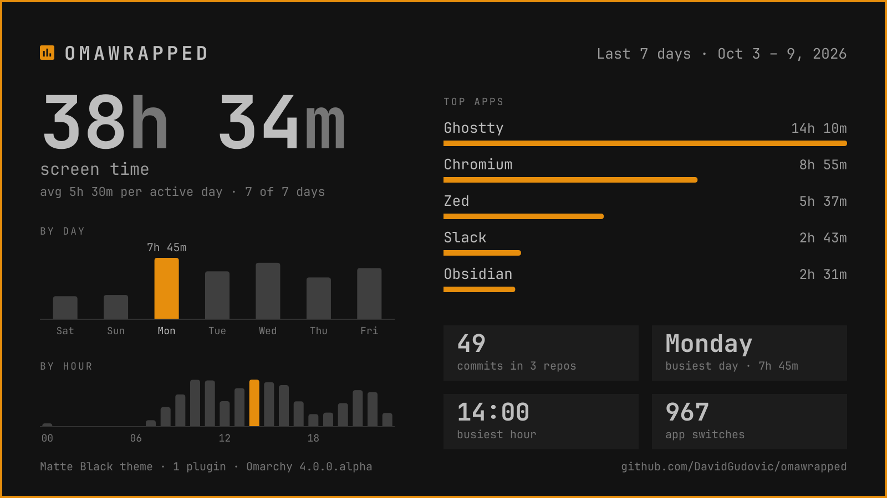
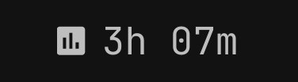
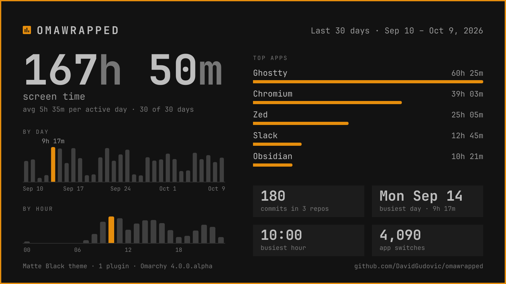
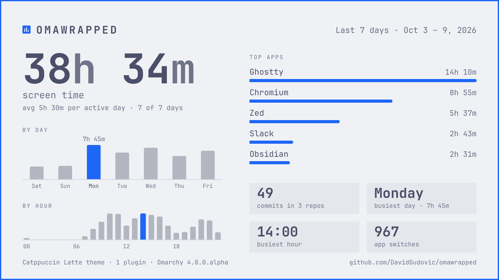

# OmaWrapped

Your week on [Omarchy](https://omarchy.org/) as one card you can post: how long you were at the screen, which apps got that time, your busiest day and hour, and how many commits you made. Drawn in your current theme's colours and font.





The widget as the bar draws it, enlarged.

OmaWrapped is a plugin for the Omarchy shell. It has two parts:

- **A bar widget** that shows today's screen time. Click it for a card of the last 7 days, right click for the last 30. The card is opened, put on the clipboard as a picture and announced. A middle click opens a menu: today so far, the last card, and a pause.
- **An `omawrapped` command** that draws the card, copies or shows it, prints the numbers behind it, and wipes the data.

Everything is counted on your machine and stays there. OmaWrapped makes no network requests, and it never looks at window titles. See [Privacy](#privacy) for exactly what is stored.

## Install

OmaWrapped needs Omarchy 4 ("Quattro") or later.

```bash
omarchy plugin add https://github.com/DavidGudovic/omawrapped.git
omarchy plugin enable io.github.davidgudovic.omawrapped
```

`add` clones this repository to `~/.config/omarchy/plugins/io.github.davidgudovic.omawrapped/` and leaves the plugin switched off, so you can read the code first. `enable` puts the widget in the right section of the bar, next to the tray, and starts the counting.

The widget is a chart icon with today's screen time beside it. Drag it to where you want it, like any other bar widget.

The widget is all you need. To also run `omawrapped` from a terminal, link the command into a folder on your `PATH`:

```bash
ln -s ~/.config/omarchy/plugins/io.github.davidgudovic.omawrapped/bin/omawrapped ~/.local/bin/omawrapped
```

Counting starts when you enable the plugin; there is no history from before that. The bar starts at `0m`. A card can be drawn once a minute has been recorded, and is worth making after a day or two.

To update later:

```bash
omarchy plugin update io.github.davidgudovic.omawrapped
```

Omarchy shows what changed and asks before it applies anything.

OmaWrapped needs nothing that Omarchy does not already ship. [What it needs](#what-it-needs) lists each tool and what happens without it.

## Use

Click the widget, or:

```bash
omawrapped card              # last 7 days -> ~/Pictures/omawrapped-2026-10-09.png, path copied
omawrapped card --month      # last 30 days -> ~/Pictures/omawrapped-2026-10-09-month.png
omawrapped card --days 14    # any number of days, today included (--today for today alone)
omawrapped today             # today's screen time and top apps, without drawing a card
omawrapped copy              # the last card's picture -> clipboard
omawrapped show              # the last card, selected in the file manager
omawrapped menu              # the same choices in Omarchy's menu (what a middle click does)
omawrapped pause             # stop counting until you resume
omawrapped resume            # count again
omawrapped stats             # the same numbers as text; add --json for scripts
omawrapped status            # what is stored, whether the sampler runs, what it ignores, what is installed
omawrapped reset             # delete everything that was recorded
```

Options for `card`:

| Option | What it does |
|---|---|
| `-o FILE` | Save somewhere else. A name ending in `.svg` saves the drawing itself. |
| `--copy path\|image\|none` | Put the file's path on the clipboard (default), the image itself (paste it straight into a post), or nothing. |
| `--open` | Open the card when it is done. |
| `--notify` | Say on the desktop that the card is ready, or why it is not. Clicking the notification shows the card in its folder. |
| `--exclude APP` | Leave an app out of the app list, by name or window class. Repeatable. Its time still counts as screen time. |
| `--repos DIR` | Look for git repositories here instead of the configured folders. Repeatable. |
| `--theme DIR` | Take the colours from another theme folder, for example `/usr/share/omarchy/themes/nord`. |

The card's file name carries the date of its last day, so making the same card twice in a day replaces the first.

A command that fails ends with status 1. With `--notify`, or from the menu, one that has said on the desktop why it failed ends with 3 instead.

### Sharing a card

A left or right click on the widget draws the card and does four things at once. It saves the card to the Pictures folder, opens it in the image viewer, puts the picture on the clipboard, ready to paste into a post, and shows a notification titled "Card copied" with the card as its picture. Clicking the notification shows the card in its folder.

A middle click opens Omarchy's own menu:

- **Today so far**: today's screen time and its top three apps, as a notification. Nothing is drawn and the clipboard is left alone.
- **Card of the last 7 days** and **Card of the last 30 days**: what a left and a right click do.
- **Copy card** and **Show in folder**: for the newest card in the Pictures folder.
- **Pause counting**, or **Resume counting** while it is paused.

If there is no card yet, "Copy card" and "Show in folder" say so in a notification.

From a terminal, `omawrapped copy` copies the last card, `omawrapped show` shows it in its folder, and `omawrapped menu` opens the same menu. `omawrapped card` run from a terminal copies the card's path by default; `--copy image` copies the picture instead, and `--notify` announces it.

If a tool is missing, the command names it and carries on. Without `wl-copy`, nothing is copied, but the card is still saved and opened. Without Nautilus, "Show in folder" opens the folder without selecting the card. Without Omarchy's menu, a middle click reports that; `omawrapped copy` and `omawrapped show` still work.

There is no screenshot of the menu or the notification here: the Omarchy shell draws both, so they need a running desktop to capture.

### Pausing

"Pause counting" in the menu, or `omawrapped pause`, stops the counting until you resume. Nothing is recorded meanwhile.

While paused, the widget is dimmed and shows `paused` in place of the time. "Resume counting" in the same menu, or `omawrapped resume`, starts it again.

The pause is a setting, `paused`, on the widget's bar entry. It is changed through Omarchy's own `omarchy bar set`, so it survives a restart of the shell or the machine.

Unlike `omarchy plugin disable`, a pause keeps your other settings.

### Settings

Settings live on the widget's entry in `~/.config/omarchy/shell.json`, like every Omarchy widget. Change them with `omarchy bar set`:

```bash
omarchy bar set io.github.davidgudovic.omawrapped idleSeconds 180
omarchy bar set io.github.davidgudovic.omawrapped ignoreApps "steam, org.keepassxc.KeePassXC"
omarchy bar set io.github.davidgudovic.omawrapped repoDirs "~/projects, ~/work"
omarchy bar set io.github.davidgudovic.omawrapped display icon
omarchy bar set io.github.davidgudovic.omawrapped countKeptAwake false
```

| Setting | Default | Meaning |
|---|---|---|
| `display` | `time` | `time` shows today's screen time beside the icon, `icon` the icon alone. A vertical bar always shows the icon alone. |
| `paused` | `false` | Nothing is counted while it is `true`. "Pause counting" in the menu and `omawrapped pause` set it. |
| `idleSeconds` | `120` | Counting stops once you have not touched the keyboard or mouse for this long (30 to 3600). |
| `countKeptAwake` | `true` | Whether time counts while a video or call keeps the screen awake without any input. `false` counts keyboard and mouse activity only. |
| `ignoreApps` | empty | Window classes that are never recorded, comma-separated, in any case. `hyprctl clients` shows the class of every open window. |
| `repoDirs` | `~/projects, ~/code` | Folders whose git repositories are searched for your commits. |

## What is on the card

| On the card | How it is measured |
|---|---|
| Screen time | Time the session was in use: not idle, not locked. |
| Top apps | The part of that time each app's window had focus. Web apps count under their own name, everything else in a browser as the browser. |
| By day, busiest day | Screen time per calendar day. |
| By hour, busiest hour | Screen time per hour of the day, added up over the period. |
| App switches | How often you moved from one app to a different one and stayed at least a second. |
| Commits | Commits you authored in the period, in repositories at most four folders below `repoDirs`. "You" is the e-mail each repository commits with. Merge commits are left out, and a commit on several branches or in several clones counts once. Shown when there is at least one. |
| Theme, plugins, Omarchy version | Read from Omarchy's own files when the card is drawn. |

Terminal commands are not counted. Bash keeps no time with its history by default, so a count for a period could not be trusted, and reading the history at all is more than a recap card should do.

## More pictures



The last 30 days, in the Matte Black theme.



The last 7 days in Catppuccin Latte: the card takes its colours from whichever theme is active.

Every picture in this README is real output. `tests/screenshots.sh` draws them from the code in a temporary home: the cards with the `omawrapped` command from the sample days of `tests/make_sample.py`, the widget from `BarWidget.qml` with a stand-in for the bar around it. None of them shows anyone's real data.

## What it needs

Everything below ships with Omarchy, so there is normally nothing to add. `omawrapped status` tells you if something is missing.

| Package | Used for | Without it |
|---|---|---|
| `python` 3.11 or later | the `omawrapped` command | no card; the widget still counts |
| `librsvg` (`rsvg-convert`) | turning the drawing into a PNG | `omawrapped card -o card.svg` still works |
| `python-gobject` (Pango, Gio) | measuring text so nothing overflows; sending notifications | widths are estimated for a monospace font; nothing is announced |
| `wl-clipboard` (`wl-copy`) | copying the card or its path | nothing is copied; the card is still saved |
| `xdg-utils` (`xdg-open`) | opening the card after a click | the card is saved but not opened |
| `omarchy-notification-send` (part of Omarchy) | the widget's own short note when the command could not run | that note is not shown |
| `omarchy-menu-select` (part of Omarchy) | the middle-click menu | no menu; `omawrapped copy` and `omawrapped show` still work |
| `omarchy-bar` (part of Omarchy) | pausing, and changing the settings | no pause; the widget still counts |
| `nautilus` | showing the card in its folder | the folder is opened with `xdg-open`, the card not selected |
| `git` | counting your commits | the card has no commit count |
| `fontconfig` (`fc-match`) | finding your monospace font | the generic `monospace` is used |

## How it counts, and what that costs

OmaWrapped starts no background program. The counting is a small service inside the Omarchy shell (`Service.qml`), which already knows the three things that matter:

- **Which app has focus.** The shell is told by the compositor when focus changes. OmaWrapped reads the app id of the focused window (its window class) and nothing else about it.
- **Whether you are there.** The compositor reports when there has been no input for `idleSeconds`. A playing video or a call holds that off, the same way it keeps your screen from locking, so watching something counts. Switch `countKeptAwake` off if you would rather count input only.
- **Whether the session is locked.** The service asks Hyprland for its monitor state over Hyprland's local socket, and looks for the lock in the answer. It asks when it starts, whenever focus or idle state changes, which is what locking and unlocking do, and every 15 seconds besides.

Each change closes one stretch of time and opens the next, so time is attributed to the second, not sampled. The stretches are added up in memory and written out once a minute, and when you go idle or lock, into one small file per day. While you are away nothing is written.

A few rules keep the numbers honest:

- The `idleSeconds` before you are noticed as away are counted; there is no way to know you had already left.
- The screensaver is a window, but time in front of it is not counted.
- If the machine sleeps, the gap is dropped: a stretch longer than 45 seconds between two ticks cannot have been watched.
- An app switch counts once the new app has held focus for a second. Focus passes over windows all the time without anyone switching, for instance when a workspace changes or the screensaver starts.
- When the shell is closed or reloads its plugins, the service writes what it has first. A crash, a power cut or a session that ends without the shell closing loses at most the last minute.

**Cost.** One timer tick every 15 seconds that does a few additions and sends Hyprland one small request, the same request once after each change of focus or idle state, and one read and write of about a kilobyte per minute while you are at the screen. That read and write happen on the shell's own thread; the file is small enough for this not to be felt. While you are away the file is still read once a minute, and nothing is written. Measured with `tests/live.sh`, which hosts the service alone in a Quickshell of its own: a 12-second run used 0.09 seconds of CPU, which is Quickshell starting, and a 330-second run used 0.12. The 0.03 seconds between them are five minutes of sampling, about a hundredth of a percent of one core. The data is about 1 KB per day of use.

## Privacy

**What is recorded.** One file per calendar day, holding five things: the day's date, the total time in use, that time split over the 24 hours of the day, that time split by app, and the number of app switches. This is a whole day's file:

```json
{"version":1,"date":"2026-10-09","active_ms":23246080,
 "hours_ms":[102469,0,0,0,0,0,0,179151,807821,1305593,1721325,2271180,1614269,1192715,1771259,2350198,2317325,1207639,521729,981787,815485,2378474,1300784,406877],
 "apps_ms":{"com.mitchellh.ghostty":7048687,"chromium":5396753,"dev.zed.Zed":4533714,"web:web.whatsapp.com":1643122},
 "switches":122}
```

An app is named by its window class, such as `chromium` or `com.mitchellh.ghostty`. A web app installed as its own window has a class like `chrome-web.whatsapp.com__-Default`, made of its site, the rest of its address and the browser profile. Only the site is kept, as `web:web.whatsapp.com`. Ordinary browser tabs are only ever `chromium`.

**What is never recorded.** Window titles, page addresses (of a web app, only the site's host name, as above), file names, what you type, the commands you run, screenshots, or anything else about what happens inside an app. The service does not read window titles at all. The files hold no time finer than the hour of the day.

**Where it is.** `~/.local/share/omawrapped/days/`, one `YYYY-MM-DD.json` per day, in a folder only your user can open (mode 700; the service makes it so again if the folder is ever deleted and recreated). The day files are closed to other users as well (mode 600). Nothing is stored anywhere else, and nothing is ever sent anywhere: the plugin contains no network code.

**What drawing a card reads.** The day files; `git log` in your own repositories (commit ids, author dates and author e-mails, to count yours; never messages or contents, and nothing is fetched); the colours and name of your theme; the number of folders in `~/.config/omarchy/plugins`; its own settings in `shell.json`; and the names in your `.desktop` files, to show "Files" instead of `org.gnome.Nautilus`. All of it read-only.

**Sharing.** Copying a card puts the picture on your clipboard, and Omarchy's clipboard history keeps it like anything else you copy. Nothing is uploaded or sent anywhere: posting the card is something you do yourself.

**Other users of the machine.** What a program is started with can be read by every user of a machine, in the process list. OmaWrapped puts nothing about what you did there. Notifications are sent by the command itself, over your session bus, and not through a program that takes the text as arguments. The clipboard gets its picture or path through standard input. `git` is run inside each repository instead of being told where it is. The one thing of yours that does appear is the path of a card, when the image viewer or the file manager is asked to open it. Cards are saved readable by you alone (mode 600); change that with `chmod` if another user of the machine should be able to open the file.

**Keeping an app out.** Add its window class to `ignoreApps` and it is no longer recorded: time in it does not count at all. Capitals do not matter, and a web app is matched by its site whatever page it is on. An ignored app is also left off cards for days recorded before you ignored it, though its earlier time stays in those days' files until you reset. `omawrapped status` shows what is being ignored. To keep an app off one card only, use `omawrapped card --exclude`.

Disabling the plugin loses this list: see [Remove](#remove).

**Wiping it.** `omawrapped reset` deletes every recorded day and tells the running service to forget the minute it still holds. Deleting `~/.local/share/omawrapped` by hand works too; the service then writes only what it had not saved yet, at most a minute. Cards you already saved are ordinary pictures in your Pictures folder; delete them like any other.

## What it creates

| Path | What | Removed by |
|---|---|---|
| `~/.config/omarchy/plugins/io.github.davidgudovic.omawrapped/` | the plugin itself | `omarchy plugin remove` |
| the widget's entry in `~/.config/omarchy/shell.json` | position and settings, written by Omarchy when you enable or configure the widget | `omarchy plugin disable` or `remove`, settings included |
| `~/.local/share/omawrapped/` | the recorded days, readable by you only | `omawrapped reset` while the plugin is in use; deleting the folder once it is removed |
| `~/Pictures/omawrapped-*.png` | cards you asked for, readable by you only | you |
| `~/.local/bin/omawrapped` | the link, if you made it | you |

OmaWrapped writes nothing else. It installs no service, timer or autostart entry, and it does not edit your configuration.

## Remove

```bash
omarchy plugin remove io.github.davidgudovic.omawrapped   # stops the counting; removes the plugin and its bar entry
rm -rf ~/.local/share/omawrapped                          # the recorded days
rm -f ~/.local/bin/omawrapped                             # the link, if you made it
```

Run them in this order: the service writes its last minute as it stops, so the data folder goes after the plugin. Nothing else is left behind. Saved cards stay in your Pictures folder until you delete them.

To stop counting for a while without removing anything, pause it: see [Pausing](#pausing). `omarchy plugin disable io.github.davidgudovic.omawrapped` also stops the counting and keeps what was recorded, but it does not keep your settings: Omarchy stores a widget's settings on its bar entry and removes the entry when the widget is disabled. After enabling it again, set `ignoreApps` and the others again before you rely on them; `omawrapped status` shows what is in effect.

## Good to know

- Only time with the shell running and the plugin enabled is counted.
- Disabling the widget removes its settings along with its bar entry, `ignoreApps` included. To take a break, pause instead.
- One window has focus at a time. A video on a second monitor while you work in a terminal counts for the terminal.
- When the shell starts or reloads its plugins, the compositor's idle timer starts over. If nobody is there at that moment, up to `idleSeconds` are counted once.
- Lock detection asks Hyprland, the compositor Omarchy runs on.
- Commits are found by the e-mail your repositories are configured with. Work committed under another address is not counted.
- The card is in English and uses a 24-hour clock.

## Development

```bash
tests/check.sh               # everything: accounting, command, manifest, service and widget, all headless
tests/screenshots.sh         # redraw the pictures in this README from the code, in a temporary home
tests/live.sh 300            # run the real sampler against your session for 5 minutes, without installing
tests/live.sh 300 ~/ow-try   # the same, keeping what it recorded: XDG_DATA_HOME=~/ow-try bin/omawrapped stats
tests/make_sample.py ~/ow-try --repos && XDG_DATA_HOME=~/ow-try/data bin/omawrapped card --repos ~/ow-try/repos -o ~/ow-try/card.png
```

The tests see notifications on a D-Bus daemon of their own, started by `tests/fake_bus.py` (it needs `dbus-daemon`, from the `dbus` package). They never use your session's bus.

`Tracker.js` is the accounting, as pure functions. `Service.qml` connects it to the session and the disk. `BarWidget.qml` is the bar widget. `omawrapped/` is the command: `store` reads the day files, `aggregate` sums them, `gitstats` counts commits, `system` reads theme and names, `card` draws, `render` measures text and calls `rsvg-convert`. `tests/check.sh` needs `node`, plus the system Python, `jq` and Quickshell that Omarchy already has, and touches neither your session, your clipboard nor your recorded data. `tests/live.sh` only listens to your session, and records into a temporary folder.

## License

[MIT](LICENSE)
